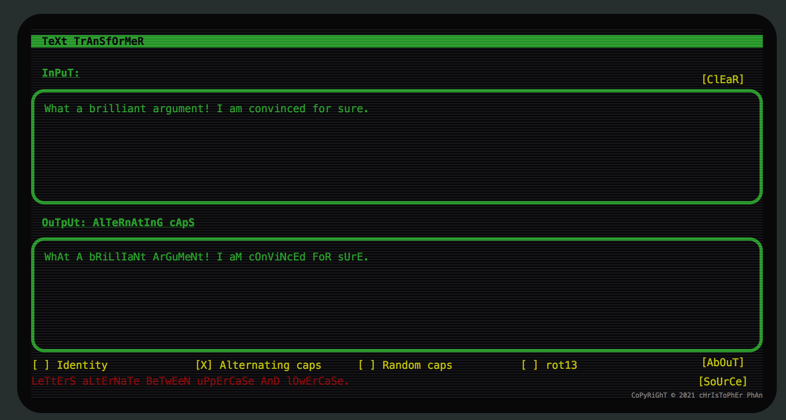

# text-transformer
Javascript toy that lets you make text LoOk LiKe ThIs, or LIke tHIS, or rira yvxr guvf.

This was a fun little project I completed to practice with JavaScript and CSS.
I came up with the idea when I was on a social media site and wanted to post something
in the SARcAsTIC HAPHAZarD CAPiTAlIzAtiON StYLE. Instead of hitting the [SHIFT] key randomly, I decided to write a JavaScript function to capitalize letters randomly. Then, I thought I should make a web page with the function. And then, I thought, why not make it look kind of like a 1980s computer?
(The retrocomputing sytle idea I had implemented in [a recent pi day post,](https://chrisphan.com/pi_day_2021/) although not as well as here.) I hope you enjoy it!

- Implementation: <https://chrisphan.com/text-transformer/index.html>